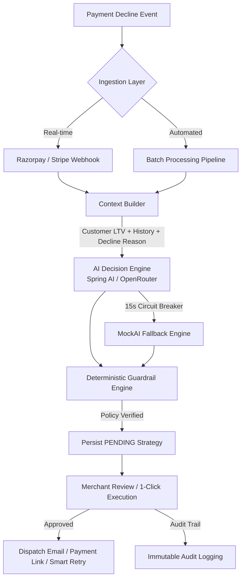

# RecoverAI — Autonomous Revenue Recovery Decision Engine 🚀


> **RecoverAI** is an intelligent, autonomous dunning and revenue recovery platform. It replaces blunt, calendar-based payment retries with contextual AI decisions, deterministic safety guardrails, automated batch pipelines, and seamless merchant-in-the-loop review.

---

## 📌 Problem Statement

In subscription and recurring e-commerce businesses, **involuntary churn** caused by failed payments accounts for up to **40% of customer loss**.

### Why Traditional Recovery Tools Fail:
1. **Blunt, Rigid Calendars:** Legacy dunning tools retry failed cards on fixed static intervals (e.g., *Day 3, Day 5, Day 7*) regardless of whether the decline was caused by transient network glitches, insufficient funds, or a hard bank decline.
2. **Cardholder & Merchant Friction:** Repeatedly retrying hard-declined or expired cards triggers bank penalty fees, damages merchant reputation with payment gateways, and frustrates customers.
3. **No Contextual Intelligence:** Traditional tools treat a high-LTV VIP customer ($5,000+ spend) identical to a brand new low-tier user, missing tailored recovery approaches (e.g., personalized checkout links vs. gentle SMS reminders vs. VIP support escalation).

---

## 💡 The RecoverAI Solution

RecoverAI transforms payment recovery from a blind script into a precision decision engine:



1. **Rich Contextual Assembly:** Deep analysis of historical checkout success rate, customer lifetime value (LTV), previous retry counts, and gateway failure codes.
2. **AI-Driven Strategy Formulation:** Structured LLM prompting via Spring AI evaluating optimal recovery actions (`RETRY_PAYMENT`, `SEND_PAYMENT_LINK`, `REQUEST_PAYMENT_METHOD_UPDATE`, `SEND_REMINDER`, `ESCALATE_TO_HUMAN`, `STOP_RECOVERY`).
3. **Deterministic Safety Guardrails:** Hard business policy rules that supersede LLM outputs to prevent repeated retries on exhausted cards or over-spending recovery effort on low-value items.
4. **Resilient Circuit-Breaker Architecture:** 15-second timeout and automated fallback to an internal heuristic `MockAIProvider` if external LLM gateways encounter rate limits or network latency.
5. **Human-in-the-Loop Merchant Review:** Merchants can inspect AI reasoning, confidence scores, and expected recovery amounts before 1-click execution.

---

## 🌟 Core Features

### 🧠 1. Contextual AI Decision Engine
- Builds an aggregated payload containing customer lifetime spend, reliability scores, decline categories (soft vs. hard), and historical attempts.
- Produces structured JSON output with strategic reasoning, confidence probabilities (0–100%), risk levels, and expected recovery amounts in INR (₹).

### 🛡️ 2. Policy-Enforced Safety Guardrails
- **No Hallucination Risk:** Guardrails strictly enforce allowed action types and validate amounts against invoice caps.
- **Status Validation:** Automatically stops recovery if the transaction is already recovered or hard-declined.

### ⚙️ 3. Autonomous Batch Processing Pipeline
- Spring Boot `@Scheduled` background worker continuously scans the database every 30 seconds for unprocessed `FAILED` or `AT_RISK` transactions.
- Automatically generates AI recovery strategies in batches of 5 without blocking web traffic.

### ⚡ 4. Real-Time Webhook Simulation
- Ingests `payment.failed` gateway events (`/api/webhooks/razorpay`) and immediately queues contextual analysis.

### 📬 5. Live SMTP Email Dispatch
- Integrated with `JavaMailSender` and Gmail SMTP to dispatch real branded HTML confirmation emails for custom demo inquiries directly to customer inboxes.

### 📊 6. Interactive Merchant Dashboard & ROI Analytics
- Real-time KPI metrics: Revenue at Risk, Revenue Recovered, Overall Recovery Rate, and Active Invoices.
- Comparative ROI visualizer: **Baseline Recovery vs. RecoverAI** showing net financial gain and recovered invoice counts.

### 📜 7. Governance & Audit Logging
- Immutable audit log capturing every payment failure, AI decision, guardrail override, and merchant approval action.

---

## 🛠️ Tech Stack

| Layer | Technologies |
|---|---|
| **Frontend** | React 18, TypeScript, Vite, Tailwind CSS, Lucide Icons, TanStack Query v5, React Router v6 |
| **Backend** | Java 21, Spring Boot 3.4.3, Spring Data JPA, Spring AI (OpenAI/OpenRouter integration), JavaMailSender |
| **Database** | PostgreSQL 16 (Production) / In-Memory H2 with PostgreSQL compatibility mode (Local Dev) |
| **Testing** | JUnit 5, Mockito, Spring Boot Starter Test |
| **Build Tools** | Maven 3.9+, npm 9+ |

---

## 📂 Project Architecture & Directory Layout

```
RecoverAI/
├── backend/
│   ├── src/main/java/com/recoverai/
│   │   ├── config/             # CORS, Security, AI & App Config
│   │   ├── controller/         # REST API Controllers (Transaction, AI, Webhook, Contact, Analytics)
│   │   ├── dto/                # Request / Response Data Transfer Objects
│   │   ├── entity/             # JPA Entities (Customer, Transaction, PaymentAttempt, RecoveryAction, AuditLog)
│   │   ├── exception/          # Global Exception Handling & Error Responses
│   │   ├── repository/         # Spring Data JPA Repositories
│   │   └── service/
│   │       ├── ai/             # AIRecoveryService, SpringAIProvider, MockAIProvider, ContextBuilder
│   │       ├── guardrail/      # RecoveryGuardrailService (Deterministic Policy Layer)
│   │       ├── simulation/     # BaselineStrategy & Comparison Engines
│   │       ├── EmailService.java           # HTML Mailer with live SMTP / Sandbox fallback
│   │       ├── BatchProcessingService.java # Scheduled Cron Pipeline
│   │       └── DataSeederService.java      # 500 Customers & 1000 Transactions Seeder
│   └── pom.xml
└── frontend/
    ├── src/
    │   ├── components/         # UI Primitives (Cards, Badges, Buttons, Skeletons)
    │   ├── context/            # AuthContext (Multi-tenant state)
    │   ├── hooks/              # Custom React Query Hooks (useTransactions, useDashboard)
    │   ├── layouts/            # Sidebar, Header & Workspace Shells
    │   ├── pages/              # Landing, Dashboard, Transactions, Detail, Analytics, Audit, Signup
    │   └── services/api/       # Axios API Clients
    └── vite.config.ts
```

---

## 🔌 API Reference

| Method | Endpoint | Description |
|---|---|---|
| `GET` | `/api/health` | Service health status and JVM metrics |
| `GET` | `/api/dashboard/summary` | Top-level KPI counts, revenue overview, and recent actions |
| `GET` | `/api/transactions` | Paginated transaction list with search, status & risk filters |
| `GET` | `/api/transactions/{id}` | Detailed transaction view with customer profile & payment history |
| `POST` | `/api/transactions/{id}/ai-decision` | Generates and persists a contextual AI recovery strategy |
| `POST` | `/api/transactions/{id}/execute-strategy` | Executes or rejects an approved recovery strategy |
| `POST` | `/api/webhooks/razorpay` | Ingests payment failure webhooks and queues AI analysis |
| `GET` | `/api/analytics/summary` | Aggregate recovery statistics and time-to-recovery |
| `GET` | `/api/analytics/recovery-comparison` | Baseline vs. RecoverAI financial comparison metrics |
| `GET` | `/api/audit-logs` | Filterable immutable compliance event trail |
| `POST` | `/api/contact/demo` | Dispatches custom demo inquiry and live SMTP confirmation email |

---

## ⚡ Getting Started (Local Setup)

### Prerequisites
- **Java 21 JDK** or newer
- **Apache Maven 3.9+**
- **Node.js 18+** & **npm 9+**

---

### 1. Configure Environment Variables

Create `.env` in `backend/`:
```env
# Spring AI OpenRouter Model Config
SPRING_AI_OPENAI_API_KEY=your_openrouter_api_key
SPRING_AI_OPENAI_BASE_URL=https://openrouter.ai/api
SPRING_AI_OPENAI_MODEL=openrouter/free

# (Optional) Gmail SMTP for Live Inbox Email Delivery
SPRING_MAIL_HOST=smtp.gmail.com
SPRING_MAIL_PORT=587
SPRING_MAIL_USERNAME=your_email@gmail.com
SPRING_MAIL_PASSWORD=your_16_digit_app_password
SPRING_MAIL_SMTP_AUTH=true
SPRING_MAIL_SMTP_STARTTLS_ENABLE=true
```

---

### 2. Start the Backend Server

```bash
cd backend
powershell -ExecutionPolicy Bypass -File run-backend.ps1
# OR
mvn spring-boot:run
```
- **Backend Port:** `http://localhost:8080`
- **Health Check:** `http://localhost:8080/api/health`
- **Database Console:** `http://localhost:8080/h2-console` *(Auto-seeded with 500 customers & 1000 transactions)*

---

### 3. Start the Frontend Application

```bash
cd frontend
npm install
npm run dev
```
- **Frontend App:** `http://localhost:5173`

---

## 🧪 Verification & Demo Walkthrough

1. **Landing Page (`/`):** Test the interactive **AI Sandbox Simulator** and submit an email to verify live SMTP delivery.
2. **Dashboard (`/dashboard`):** Inspect real-time recovery metrics and high-priority flagged transactions.
3. **Transactions Review (`/transactions`):** Filter by `AI Review Ready` to identify transactions ready for merchant review.
4. **Transaction Detail (`/transactions/:id`):** Click **"Analyze with RecoverAI"** to observe contextual decision formulation, expected recovery calculation, and 1-click **"Approve Strategy"** execution.
5. **Analytics (`/analytics`):** View the ROI comparison graphs showing RecoverAI's uplift over legacy dunning approaches.
6. **Audit Logs (`/audit`):** Verify the complete compliance trail showing actor actions and timestamps.

---

## 📄 License
This project is licensed under the MIT License.
